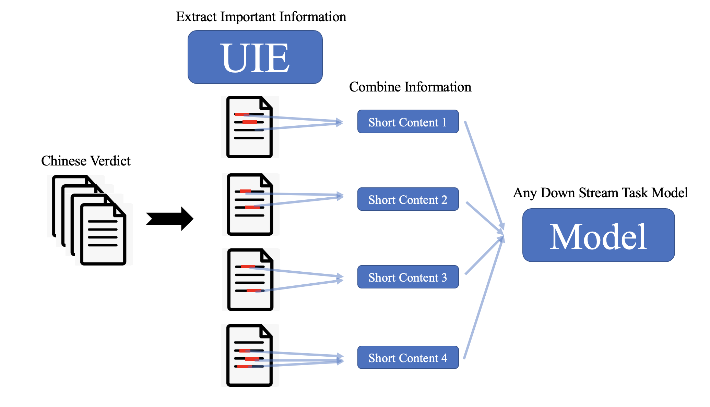

# Two-Stage Chinese Verdict Classification (二階段臺灣司法判決書分析)

--- 


## Guide


| **Section**                                      |  **Description** | 
|:------------------------------------------------:|:----------------:|
|<a href=#Introduction> Introduction </a>          | Introduction to the method and long sequence issue| 
|<a href=#Two-Stage Architecture> Architecture </a>| Detail the architecture of two-stage method and scenario|
|<a href=#Results> Results </a>                    | Methods comparison on long sequence       |
|<a href=#Quick Start> Quick Start </a>            | Implement the two-stage analysis|


## Introduction

In this work, we present a **two-stage Chinese verdict classification method** to overcome the **long sequence issue** on Chinese verdict tasks. The two-stage method reaches better performance than the recurrent model like XLNet. 


In the past, addressing the issue of long sequence might involve using recurrent models or truncate the sequence. However, we have discovered that our proposed two-stage model can effectively **extract important information**, which can then be **fed into any downstream tasks**. This approach proves to be a viable solution for overcoming the challenges posed by long texts.

## Two-Stage Architecture

Our designed two-stage method is illustrated in the following diagram. This method can overcome challenges posed by any long sequence and only requires replacing the downstream task model.

</img>


The key to this architecture lies in the [UIE (Universal Information Extraction)](https://github.com/PaddlePaddle/PaddleNLP/tree/develop/model_zoo/uie) model, which is presented by [PaddleNLP](https://github.com/PaddlePaddle/PaddleNLP/tree/develop) and has shown excellent performance on Chinese NLP tasks such as NER (Named Entity Recognition) or RE (Relation Extraction). We use UIE model to extract the important information and collect the information to feed the downstream task model.

### Stage 1: Extract Information

⚡ **Information Extraction**: We first use UIE model to extract the important information in each content and get the index of each information.

⚡ **Index Windows**: Secondly, locate the index of important information, and open the windows on each index to extract the important paragraph.

⚡ **Aggregation**: Finally, aggregate all important paragraph for downstream task.


### Stage 2: Downstream task

After obtaining the paragraph containing important information, we get a **shorter sequence**, effectively addressing the issue of long sequence that models struggle to handle. 

The downstream task is then determined based on the user's area of interest or focus. 

In the next chapter, we will discuss how this method can be applied to address the issue of analyzing Chinese verdicts.

### Experiment on Two-Stage Method

Through this architecture, we address the issue of Chinese Verdicts. 

💪 **Our goal is to identify the features of each verdict**, enabling us to **quickly find judgments with similar characteristics** during subsequent analysis. 

This allows us to perform simplified clustering or modeling to determine the judgment category. Additionally, by leveraging the features of each judgment, we can assist claims adjusters in **rapidly screening similar judgments, facilitating efficient matching of cases.**

## Results


| **Model**         |  **Precision** | **Recall** |  **F1** |
|:-----------------:|:--------------:|:----------:|:-------:|
|      Ernie        |  0.522  |  0.354   | 0.422     |
|  Ernie (chunk)    | 0.403 |  0.359   | 0.380    |
|  XLNet            | 0.638 |  0.461   | 0.535     |
|Two-Stage (UIE+UTC)|  **0.9276**   |  **0.9038**  |  **0.9156**   |

We use the Ernie model, which will truncate sequence that length upper than 2048, chunking Ernie model, XLNet, and our two-stage method for this task. 


As shown in the above table, our developed two-stage method clearly outperforms other methods. This indicates that for the model, long sequences can indeed be considered noise, and effective information extraction can significantly improve efficiency.

## Quick Start

### Stage 1

#### Step 1

Convert the label studio export file to the doccano format.

```python
python ./uie/labelstudio2doccano.py --labelstudio_file ./uie/label_studio_data/uie_for_utc_general_plus.json                                                    
```

#### Step 2

Split doccano format file into training / evaluation / testing

```python
python ./uie/doccano.py
```

#### Step 3

Fine-tune the UIE model.

```python
python ./uie/finetune.py  \
    --device gpu \
    --logging_steps 10 \
    --save_steps 100 \
    --eval_steps 100 \
    --seed 1000 \
    --model_name_or_path uie-base \
    --output_dir ./uie/checkpoint/model_best \
    --train_path ./uie/data/train.txt \
    --dev_path ./uie/data/dev.txt  \
    --max_seq_length 512  \
    --per_device_eval_batch_size 16 \
    --per_device_train_batch_size  16 \
    --num_train_epochs 10  \
    --learning_rate 1e-5 \
    --label_names "start_positions" "end_positions" \
    --do_train \
    --do_eval \
    --do_export \
    --export_model_dir ./uie/checkpoint/model_best \
    --overwrite_output_dir \
    --disable_tqdm True \
    --metric_for_best_model eval_recall \
    --load_best_model_at_end  True \
    --save_total_limit 1 
```

The purpose of this section is to extract paragraphs that could potentially contain important information.

Subsequently, determining whether the extracted paragraphs truly constitute important information is left to the UTC model (Stage 2) for processing.

### Stage 2

#### Step 4

Split label studio export file into training / evaluation / testing

```python
python ./utc/zero_shot_text_classification/label_studio.py  --options ./utc/zero_shot_text_classification/labelstudio_data/label.txt 
```

#### Step 5

Move the best checkpoint file of the UIE model trained in step 3 to path `./utc/zero_shot_text_classification/uie_model/`.

Extract the important information paragraphs into shorter sequence for UTC model.

```python
python ./utc/zero_shot_text_classification/uie_preprocessing.py --max_seq_len 768 --threshold 0.0 --uie_model_name_or_path ./utc/zero_shot_text_classification/uie_model/checkpoint-250-30data/ --out_folder_name test
```

#### Step 6

Fine-tune the UTC model.

```python
python ./utc/zero_shot_text_classification/run_train.py  \
    --device gpu \
    --logging_steps 5 \
    --save_steps 100 \
    --eval_steps 100 \
    --seed 1000 \
    --model_name_or_path utc-base \
    --output_dir ./utc/zero_shot_text_classification/checkpoint/model_best \
    --dataset_path ./utc/zero_shot_text_classification/data/uie_30_data_full/ \
    --max_seq_length 768  \
    --per_device_train_batch_size 8 \
    --per_device_eval_batch_size 8 \
    --num_train_epochs 25 \
    --learning_rate 1e-4 \
    --do_train \
    --do_eval \
    --do_predict \
    --do_export \
    --export_model_dir ./utc/zero_shot_text_classification/checkpoint/model_best \
    --overwrite_output_dir \
    --disable_tqdm True \
    --metric_for_best_model macro_f1 \
    --load_best_model_at_end  True \
    --save_total_limit 1 \
    --save_plm 
```